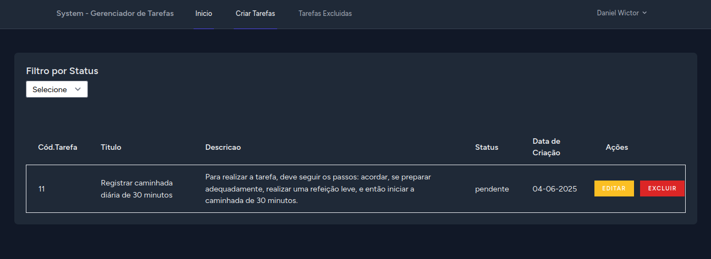
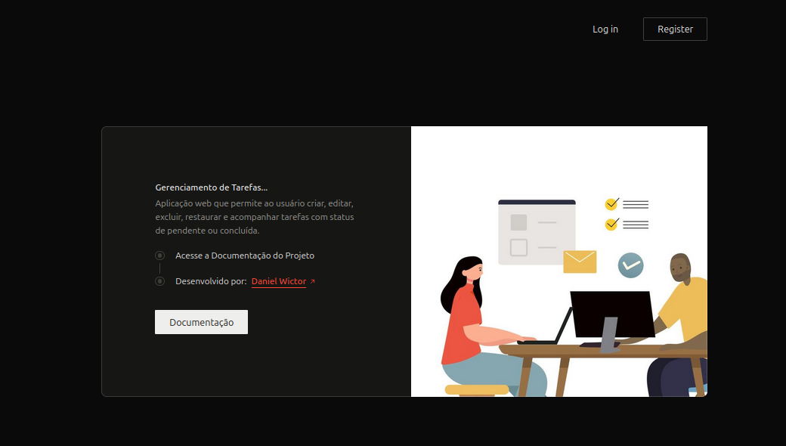

# 📋 TaskManager — Gerenciador de Tarefas


> Um sistema simples e eficiente para criação, organização e acompanhamento de tarefas.

---

## 🚀 Funcionalidades

- ✅ Criar,listar, editar e excluir tarefas
- 🗂️ Organizar tarefas por status (pendente,concluida)
- 🔍 Filtro de tarefas por status, pendente e concluida.
- 💡 Interface reativa com Livewire (sem recarregamento de página)

---

## 🛠️ Tecnologias Utilizadas

- [Laravel](https://laravel.com/) 
- [Livewire](https://livewire.laravel.com/) 
- [Tailwind CSS](https://tailwindcss.com/) 
- [Alpine.js](https://alpinejs.dev/) 
- [MySQL](https://www.mysql.com/) 
---


## 📷 Capturas de Tela


> 

---

## ⚙️ Instalação
1.Clone o repositório do projeto para sua máquina:
```bash
git clone https://github.com/seu-usuario/seu-repositorio.git
```
2. Copiar o arquivo .env
Copie o arquivo .env.example para .env:
```bash
cp .env.example .env
```
3. Subir os containers com Docker<br>
 Para iniciar o ambiente:
```bash
docker-compose up -d 
```
4.Caso aconteça algum erro de conexão ou alguma inconsistência rode esses comandos.<br>
 Após remover os containers do docker rode o comando indicado no indice 2 
```bash
docker compose down --rmi all
``` 
## Versão Atual
- Criei status para controlar melhor o fluxo das tarefas. As mensagens de erro e sucesso ficaram mais claras. Também usei componentes Blade para organizar o código e configurei o projeto com Docker para facilitar a instalação.

## Versões Futuras
- Vou incluir filtros mais avançados para facilitar a busca das tarefas. Também quero adicionar notificações para lembrar prazos e melhorar a interface para ficar mais intuitiva.

